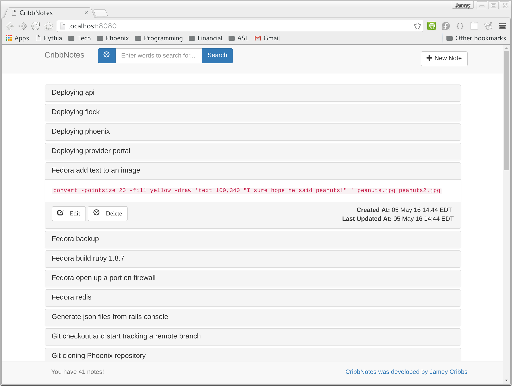

Keywords: Golang, go, web, notes

### CribbNotes - A local web application that allows you to take and search for notes

CribbNotes is a simple note taking application written in Go.  It is meant to be run locally on your machine and accessed through your browser.

  

### How to install

~~~
go get github.com/jameycribbs/cribbnotes
~~~

- go get any dependencies
- go build cribbnotes.go
- create a directory where you want to store your notes
- copy config.json.example to config.json in the directory where you are going to run the cribbnotes executable and edit it to reflect the data directory where your notes will be stored and the port you want to run the web server on
- run the cribbnotes executable that you just built
- point your browser to http://localhost:(with port number you set in config file)

### Contributions welcome!

Pull requests/forks/bug reports all welcome, and please share your thoughts, questions and feature requests in the [Issues] section or via [Email].

[Email]: mailto:jamey.cribbs@gmail.com
[Issues]: https://github.com/jameycribbs/cribbnotes/issues

